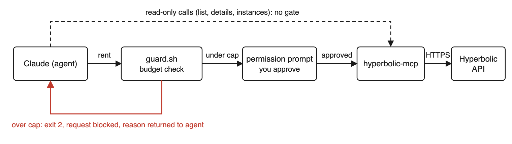

# claude-hyperbolic-guardrails


**Let Claude Code rent, test and terminate a Hyperbolic GPU from chat, with a budget cap, an approval gate, and an auto-terminate timer in front of every call that spends money.**

Companion repo for the tutorial *From Chat Prompt to Terminated Instance*. Everything here was run for real: five rentals over two days, 26 minutes of H100, about $1.25. Every guardrail except the balance ceiling fired at least once; the balance never got low enough to test it. The transcripts are in `transcript/`.

<p align="center"><br><sub>The rent path. The timer and the reaper act after this, on the rental it creates.</sub></p>

## What you get

| | |
|---|---|
| **A working server** | Hyperbolic's open-source MCP server, updated from the retired v1 routes to the live v2 API. `server/index.ts` is the file, `server/hyperbolic-mcp-v2.patch` is the diff. |
| **Guardrail 1, budget** | `guard.sh` prices the exact option from the live catalogue and blocks a rent that would pass your daily cap, your balance, or your live-rental limit. Any error blocks. |
| **Guardrail 2, approval** | `config/claude-code-settings.json` makes rent, terminate, ssh-connect and remote-shell ask you every time, even in auto-accept mode, and denies the obvious `curl` and `wget` routes to the API from the shell. |
| **Guardrail 3, timer** | `autoterminate.sh` arms a timer on every rent and terminates the rental when the window runs out. Judged by HTTP status, retried, and it raises a desktop notification if it fails (macOS or a Linux desktop; headless, look in `ledger.jsonl.log`). |
| **Backstop** | `reaper.sh` runs from cron and terminates any rental recorded in the ledger that is older than the window, for the case where the timer process dies while the machine stays up. |
| **Benchmark** | `bench/bench.py`, a one-minute bf16 matmul and bandwidth test that prints its own cost. |

## Quick start

Requirements: Node 18+, `jq` 1.6+, `curl`, Claude Code. Tested on macOS 14 with Claude Code 2.1.261.

Before you start: the hooks are a Claude Code feature. `config/claude_desktop_config.json` gives the Claude Desktop chat app the server with no budget cap and no timer. The API key is set in two places on purpose: the MCP server reads it from the `claude mcp add` environment, and the hooks read it from the shell you launch Claude Code from.

**1. Hyperbolic account.** Sign up at [app.hyperbolic.ai](https://app.hyperbolic.ai), add the $5 minimum, create an API key, and paste an SSH public key. The server cannot use a passphrase, so make a separate key:

```bash
ssh-keygen -t ed25519 -f ~/.ssh/hyperbolic_mcp -N ""
```

**2. Build the patched server.**

```bash
git clone https://github.com/HyperbolicLabs/hyperbolic-mcp.git && git -C hyperbolic-mcp checkout d2962d3
git clone https://github.com/mostafaibrahim17/claude-hyperbolic-guardrails.git
cp claude-hyperbolic-guardrails/server/index.ts hyperbolic-mcp/src/index.ts
cd hyperbolic-mcp && npm install && npm run build && cd ..
```

**3. Register it with Claude Code.** The name `hyperbolic-gpu` is load-bearing; the hooks, rules and scripts all key on it.

```bash
claude mcp add --scope user hyperbolic-gpu \
  -e HYPERBOLIC_API_TOKEN=your-key \
  -e SSH_PRIVATE_KEY_PATH=$HOME/.ssh/hyperbolic_mcp \
  -- node "$PWD/hyperbolic-mcp/build/index.js"
```

**4. Install the guardrails.**

```bash
mkdir -p ~/hyperbolic-guardrails
cp claude-hyperbolic-guardrails/*.sh ~/hyperbolic-guardrails/ && chmod +x ~/hyperbolic-guardrails/*.sh
```

Merge `config/claude-code-settings.json` into `~/.claude/settings.json`. It is a merge, not a copy: the `permissions` and `hooks` keys have to be combined with anything already there. With `jq`:

```bash
jq -s '.[0] * .[1]' ~/.claude/settings.json claude-hyperbolic-guardrails/config/claude-code-settings.json > /tmp/settings.json && mv /tmp/settings.json ~/.claude/settings.json
```

Restart Claude Code if it is already running.

**5. Run.** Export the settings in the shell you start Claude from, then start it.

```bash
export HYPERBOLIC_API_TOKEN=your-key HYPERBOLIC_BUDGET_USD=10 HYPERBOLIC_MAX_MINUTES=30 HYPERBOLIC_MAX_LIVE=1
claude
```

**6. Prove it works before trusting it.** Start a session with a cap too small for any rent and ask for one. The guard blocks before any API call, so this costs nothing:

```bash
HYPERBOLIC_BUDGET_USD=0.01 claude
# > rent the cheapest single H100
# ⎿ BLOCKED: renting 1x h100 ... Today's total would be $1.38, cap is $0.01.
```

If you see a permission prompt instead of `BLOCKED`, the hook did not run. A wrong path or a missing `chmod +x` makes Claude Code treat it as a hook error and let the call through.

## Settings

| Variable | Default | Meaning |
|---|---|---|
| `HYPERBOLIC_API_TOKEN` | none | Your Hyperbolic API key. Needed by the hooks and the reaper. |
| `HYPERBOLIC_BUDGET_USD` | 10 | Daily cap, UTC day. The sum of today's estimates in the ledger may not pass it. Terminating early does not credit an estimate back. |
| `HYPERBOLIC_MAX_MINUTES` | 30 | Auto-terminate window. The timer counts it from the order, so it includes boot time; the reaper counts it from the moment the machine is Running. Also the length used for estimates. |
| `HYPERBOLIC_MAX_LIVE` | 1 | How many rentals may be live at once. |
| `HYPERBOLIC_LEDGER` | `~/hyperbolic-guardrails/ledger.jsonl` | Where rentals, estimates and timer PIDs are recorded. Auto-terminate results land in `ledger.jsonl.log`; the last API response in `ledger.jsonl.log.last`. |
| `REAPER_ALL` | 0 | Set to 1 to make the reaper terminate every rental on the account, not only the ones in the ledger. |

## Backstop from cron

The timer is a process on your laptop. It pauses when the laptop sleeps and dies on reboot. The reaper covers the case where the timer dies while the machine stays up; a machine that is asleep runs neither. Run it every five minutes with the token in a file only you can read, entered without putting it in shell history:

```bash
umask 077; read -rs t && printf '%s\n' "$t" > ~/.hyperbolic_token
```

```
*/5 * * * * HYPERBOLIC_API_TOKEN=$(cat ~/.hyperbolic_token) HYPERBOLIC_MAX_MINUTES=30 HYPERBOLIC_LEDGER=$HOME/hyperbolic-guardrails/ledger.jsonl $HOME/hyperbolic-guardrails/reaper.sh >> $HOME/hyperbolic-guardrails/reaper.log 2>&1
```

The reaper only touches rentals whose id is in the ledger, which `autoterminate.sh` writes. A rent whose hook failed to arm is not in the ledger and the reaper will not see it; set `REAPER_ALL=1` if you want it to cover every rental on the account.

## What was proven, and how

| Check | Run | Result |
|---|---|---|
| Rent passes the budget, machine boots | 18025 | Running 2 min 20 s after the order |
| GPU is real | 18025 | `nvidia-smi` shows one H100 PCIe, 80 GB; matmul at H100 speed |
| Option vanished from catalogue | 18025 | `BLOCKED: no live option`, no prompt shown |
| Live-rental limit | 18025 | `BLOCKED: 1 rental(s) already live, limit is 1` |
| Daily cap | after 18025 | `BLOCKED: ... Today's total would be $4.09, cap is $2` |
| Manual terminate cancels the timer | 18025 | timer process gone, nothing fired later |
| Auto-terminate | 18026 | fired 8 min 2 s after the order, HTTP 200 |
| Deny rule | session | `curl` to the API refused by the permission layer |
| Reaper after a dead timer | 18028 | timer killed by hand, reaper terminated the rental once it passed the window |

## Limits

- The hooks gate the MCP tool, not the credential. The agent's shell inherits your API key and can read `~/.claude.json` or edit `settings.json`. The deny rules are best effort. The real fix is a sandbox and a key with a spend limit. Hyperbolic allows no overdraft, so your balance is the one ceiling nothing here can bypass.
- The timer is a hard stop and saves nothing first. Do not point it at a training run without a checkpoint.
- The ledger has no lock, so two rents placed at the same instant can both pass the cap.
- On-Demand virtual machines only. Reserved clusters and bare metal are not covered.
- Prices and inventory change constantly, which is why the guard prices every rent from the live catalogue at request time.

## License

MIT. `server/index.ts` is derived from [HyperbolicLabs/hyperbolic-mcp](https://github.com/HyperbolicLabs/hyperbolic-mcp), MIT, Copyright (c) 2025 Hyperbolic Labs.
